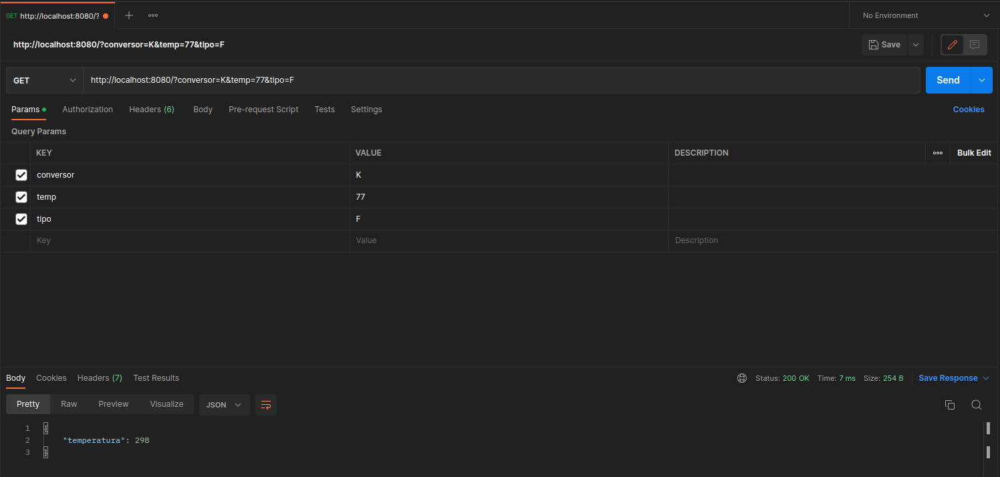

# Conversor de Temperatura - Node.js
Esse código é um simples conversor de temperatura feito com Node.js e express. O envio de dados foi feito pelo Postman, já que o projeto não possui front-end, por enquanto.
## Como usar?
É simples, são enviados três parâmetros ao back-end, a variável tipo (caractere que define para qual é a unidade da temperatura),a variável conversor (caractere que define para qual unidade de temperatura sera convertida) e a temperatura. Exemplo abaixo:

  
 
  
  Sobre o tipo, há três opções:
  
 - C: Unidade em Celsius;
 - F: Unidade em Fahrenheit;
 - K: Unidade em Kelvin;

 Sobre o conversor, o código converte para Celsius, Fahrenheit e Kelvin, então há três opções para a variável conversor:

 - C: Converte a temperatura para Celsius;
 - F: Converte a temperatura para Fahrenheit;
 - K: Converte a temperatura para Kelvin;

  

 ## Passos futuros:
 - Implementar um front-end para a aplicação;
 - Implementar filtros na passagem dos parâmetros;